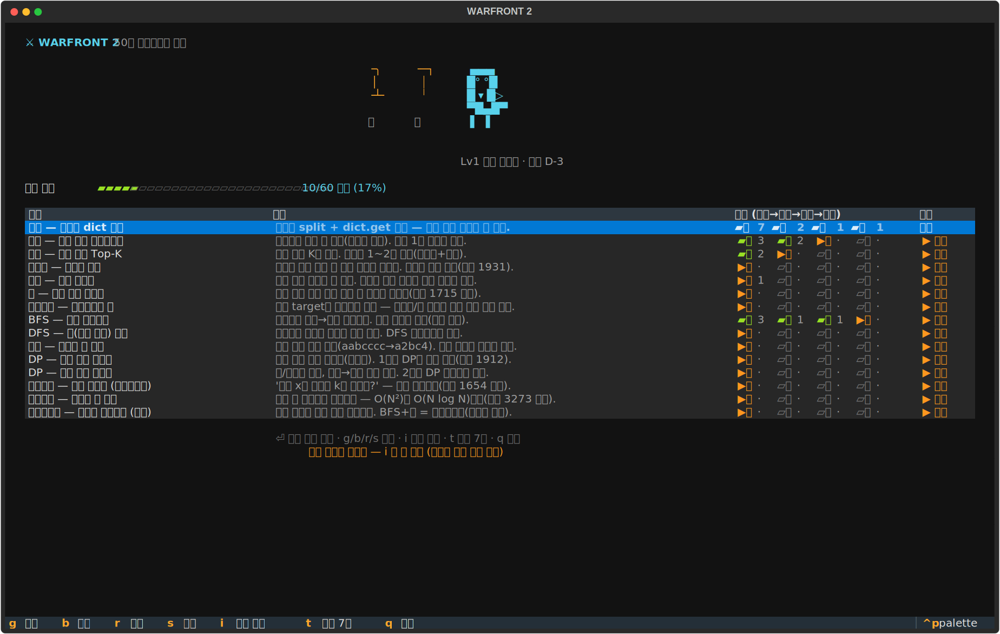
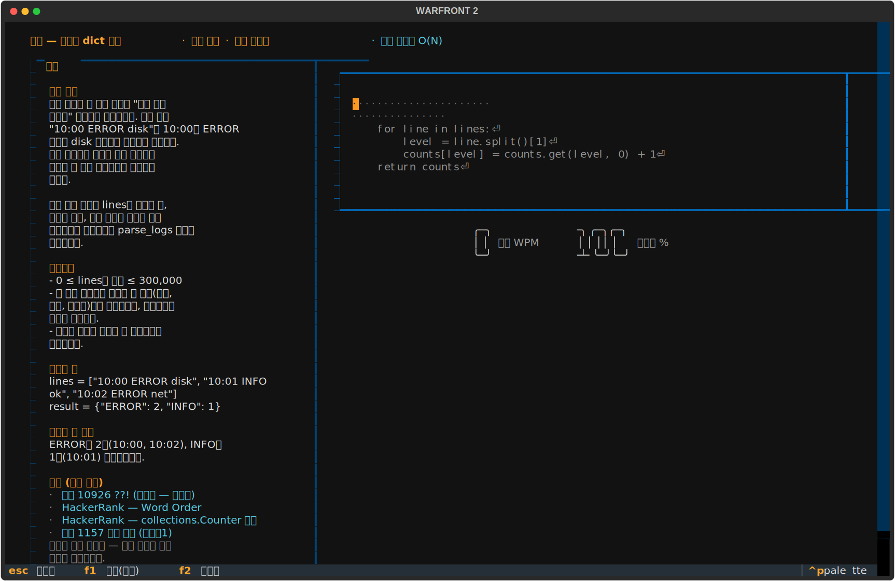
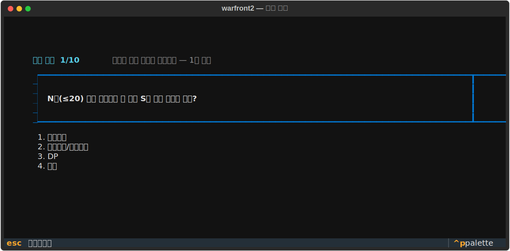

# warfront2

터미널에서 하는 코딩테스트 훈련. 하루 30분씩 50일, 급하면 7일 속성.



## 이 도구가 해결하려는 세 가지

**1. 시작이 무겁다.**
문제집을 사고, 강의를 듣고, 계획표를 짜다가 첫 문제도 못 풀고 지치는 패턴.
여기서는 설치 두 줄, 실행은 `wf` 하나입니다. 대시보드가 오늘 할 것을
정해주므로 "뭐부터 하지"를 고민할 일이 없습니다. 엔터 한 번이면 오늘
훈련이 시작됩니다.

**2. 외운 문제가 시험장에서는 딴 얼굴을 하고 나온다.**
토마토 문제로 BFS를 외웠는데 시험에는 "서버 감염 확산"이 나옵니다.
같은 문제인데 못 알아봅니다. 문제집은 챕터 제목이 유형을 미리 알려주기
때문에, 시험의 절반인 "유형 알아보기"를 한 번도 연습하지 못한 채
풀이만 연습하게 되는 겁니다.

그래서 두 가지를 따로 훈련합니다. 패턴은 보고 치고, 빈칸을 채우고,
안 보고 다시 쓰는 반복으로 손에 붙입니다. 알아보는 눈은 인식 드릴로
만듭니다. 지문만 보고 유형을 고르는 훈련인데, 문항 전부가 실제
기출(프로그래머스 고득점 Kit, 카카오 공식 해설, 삼성 기출, HackerRank
Interview Kit)에서 왔고 보기에는 헷갈리는 유형이 함정으로 섞여 있습니다.
"최단거리인데 가중치가 있으면 BFS가 아니라 다익스트라" 같은 경계를
몸으로 익힙니다.

**3. 흐름이 끊기면 처음부터.**
바빠서 일주일 쉬면 어디까지 했는지 잊어버리고, 컴퓨터를 바꾸면 기록이
사라집니다. 여기서는 단계 해금이 진도 그 자체입니다. 대시보드가 카타마다
다음 할 단계를 기억하고 있어서 언제 돌아와도 이어집니다. 기록은 본인
GitHub 저장소로 자동 백업되고, 새 컴퓨터에서 `wf setup` 한 번이면
일차·연속일·진도가 그대로 복원됩니다.

## 훈련이 돌아가는 방식

**생각 먼저.** 모든 문제는 접근을 한 줄 선언해야 에디터가 열립니다.
머리로든 연필로든 구조를 먼저 그리고 코드를 치는 습관을 강제합니다.

**패턴 15종을 4단계로.** 한국 코테 출제 빈도 순서대로 구현, 해시, 그리디,
스택, 힙, 백트래킹, BFS, DFS, 문자열, DP, 이분탐색, 투포인터, 다익스트라를
배치했습니다. 각 패턴은 보고 치기 → 빈칸 채우기 → 안 보고 재현 →
스스로 구현 순서로 올라가고, 정확도 95%를 넘겨야 다음 단계가 열립니다.



타이핑은 글자 단위로 즉시 판정됩니다. 맞으면 흰색, 틀리면 빨간색,
오타는 전진하지 않습니다. 막히면 F1이 구조 힌트를, F2가 알고리즘이
움직이는 그림을 보여줍니다.

**직접 구현은 진짜 채점.** 마지막 단계는 백지에서 함수를 작성하고
Ctrl+R로 채점합니다. 히든 테스트케이스에 대형 입력 시간제한까지 —
"맞았는데 느려서 탈락"을 연습 단계에서 미리 겪습니다. 변수명이나
구조가 모범답안과 달라도 동작이 맞으면 통과입니다.

**인식 드릴.** 대시보드에서 `i`. 지문 열 개를 1분씩 판별하고, 틀리면
그 자리에서 판별 신호와 출처를 확인합니다. 인식률 90%가 목표선입니다.



## 설치

Python 3.10 이상과 git이 필요합니다. macOS는 아무 터미널이나,
Windows는 Windows Terminal을 권장합니다.

```bash
git clone https://github.com/JK42JJ/warfront2.git
cd warfront2
pip install -e .
wf
```

## 명령과 키

```
wf                  훈련 시작
wf update           최신 문제와 기능 받기
wf setup <repo>     기록을 내 GitHub repo로 백업·복원
wf sprint           7일 속성 모드 (해제: --off)
wf reset            기록 초기화
```

훈련 중에는 키보드만 씁니다.

```
Enter     오늘 할 단계 자동 선택
g b r s   단계 직접 선택 (보고 / 빈칸 / 재현 / 구현)
i         인식 드릴
t         속성 모드 켜고 끄기
F1        힌트 (구조 → 줄 설명)
F2        알고리즘 동작 그림
Ctrl+R    채점 (구현 단계)
ESC       대시보드로
```

## 시험이 코앞일 때

대시보드에서 `t`를 누르면 7일 압축 과정이 시작됩니다. 출제 빈도가 가장
높은 유형만 골라 하루 다섯 개씩(새 패턴 더하기 전날 복습), 마지막 날은
전체 리허설입니다. 그날 할 것에 ⚡와 🔁가 붙습니다.

## 기록을 GitHub에 남기기

```bash
wf setup https://github.com/<계정>/my-records.git
```

빈 private 저장소 하나면 됩니다. 세션이 끝날 때마다 그날의 기록이
자동으로 올라가고, 다른 컴퓨터에서 같은 명령을 치면 진도가 복원됩니다.

## 콘텐츠는 어디서 왔나

문제 유형과 인식 문항은 추측으로 만들지 않았습니다. 프로그래머스 고득점
Kit 전체, 카카오 공식 해설(2022~2026 공채), 삼성 SW역량테스트 공식 기출
45문제, HackerRank Interview Preparation Kit 69문제를 원문 확인해
앵커링했고, 출처 없는 문항은 테스트가 커밋을 막습니다.

정리: [docs/SOURCES.md](docs/SOURCES.md) · 설계 근거: [docs/DESIGN.md](docs/DESIGN.md)
