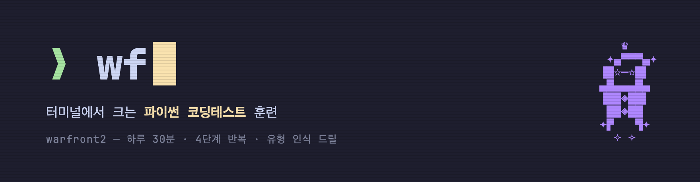
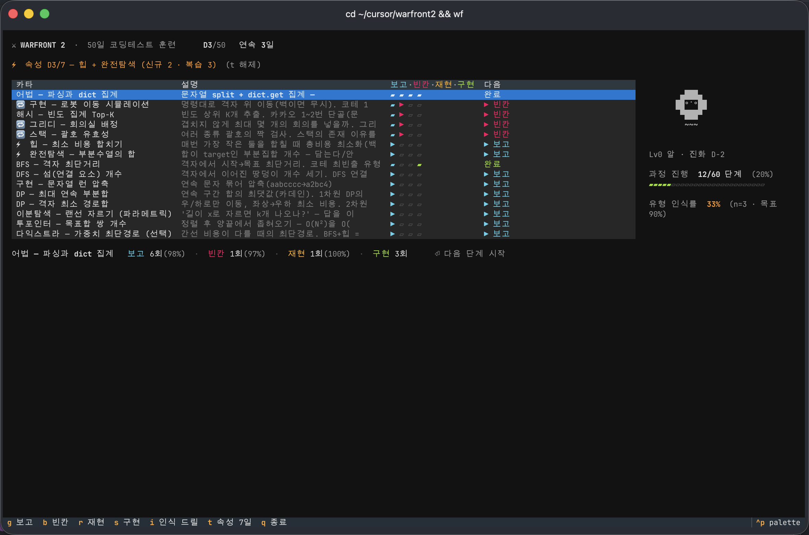
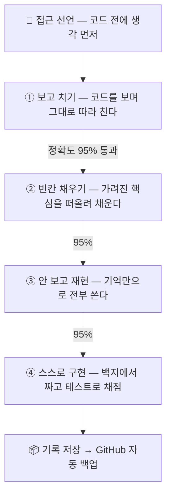
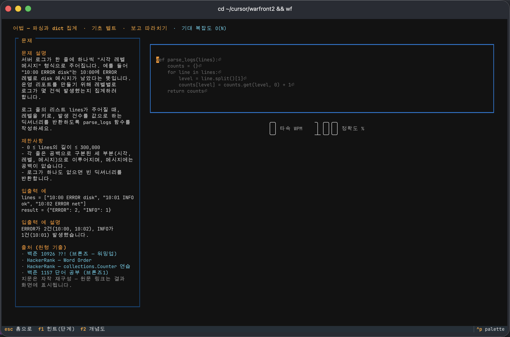
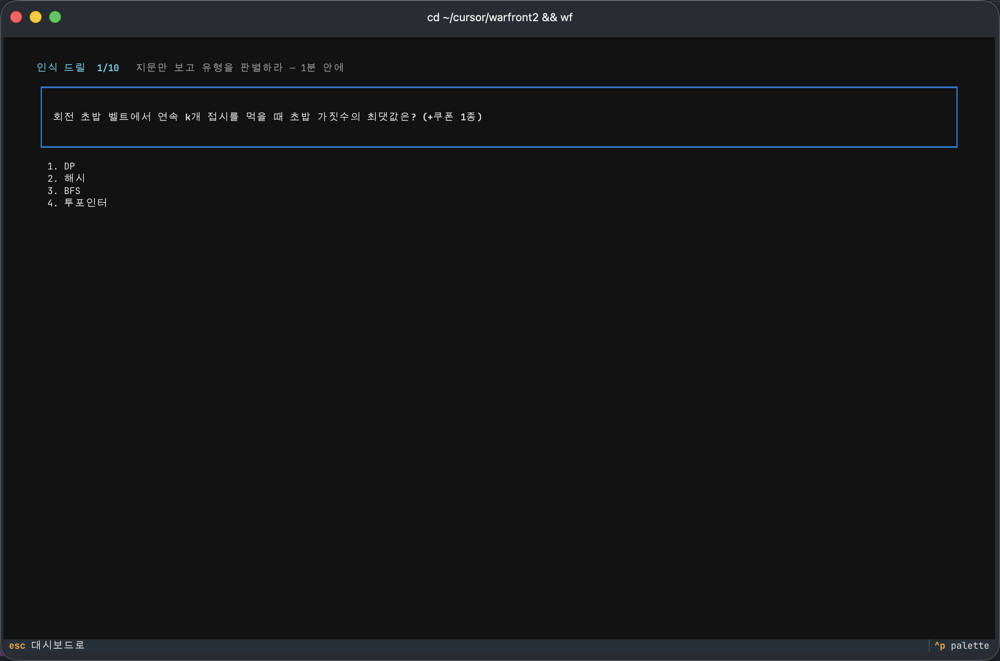
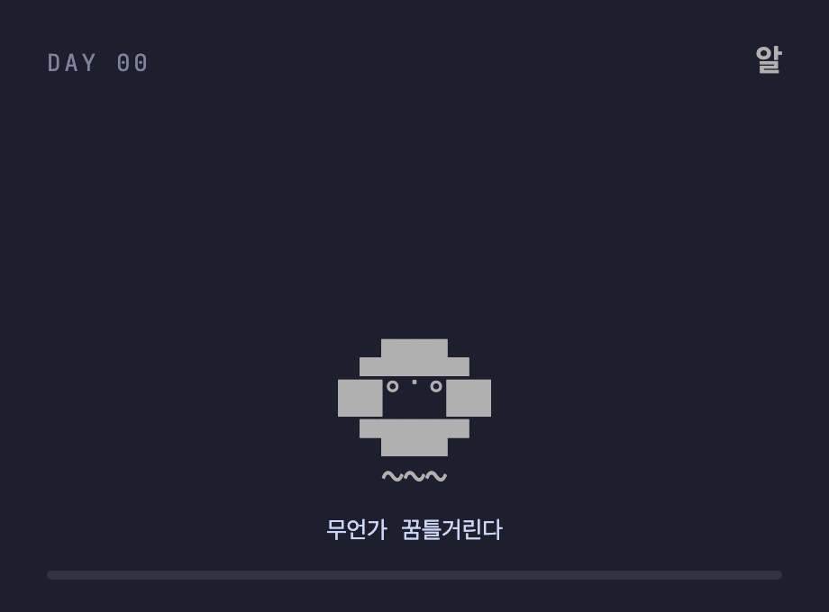

<p align="center"></p>

<p align="center">
  <a href="https://www.python.org/"></a>
  <a href="https://github.com/Textualize/textual"></a>
</p>

# warfront2

터미널에서 하는 **파이썬(Python) 코딩테스트 훈련**. 하루 30분씩 50일, 급하면 7일 속성.



## 익숙한 문제, 다른 접근

| 익숙한 문제 | warfront2 |
|---|---|
| 문제집 사고 강의 듣고 계획 짜다 지친다 | 설치 두 줄, 실행은 `wf` 하나. 오늘 할 일은 대시보드가 정해준다 |
| 외운 문제가 시험장에서는 딴 얼굴로 나온다 | 풀이 반복과 **유형 알아보기**를 따로 훈련한다 |
| 쉬다 오면 어디까지 했는지 모르고, 컴퓨터 바꾸면 기록이 사라진다 | 진도는 자동 기억, 기록은 GitHub 백업 — `wf setup` 한 번이면 복원 |

> [!IMPORTANT]
> **외운 문제를 왜 못 알아보는가** — 이 도구의 출발점
> 1. 연습: *"익은 토마토가 하루마다 옆 토마토를 익게 한다. 전부 익는 데 며칠?"*
> 2. 시험: *"감염된 서버가 매 시간 인접 서버를 감염시킨다."*
> 3. 이야기만 다른 **같은 문제**인데 못 알아본다.
>
> 문제집은 챕터 제목이 유형을 미리 알려주기 때문에, 시험의 절반인
> "알아보기"를 연습할 기회가 없었던 것. 그래서 여기서는 **풀이**와
> **알아보기**를 따로 훈련한다.

## 훈련 흐름



여기에 매일 5분, 인식 드릴(`i`)로 "유형 알아보기"를 따로 훈련합니다.

> [!NOTE]
> 모든 문제는 **접근을 한 줄 선언해야 에디터가 열립니다.**
> 머리로든 연필로든 구조를 먼저 그리고 코드를 치는 습관을 만들기 위해서입니다.

### 같은 패턴을 네 번, 조금씩 더 어렵게

운전을 배울 때 옆에서 보고, 연수 코스를 돌고, 혼자 몰아보는 순서와 같습니다.

| 단계 | 화면에 보이는 것 | 내가 하는 것 |
|---|---|---|
| ① 보고 치기 | 코드 전체 — `q = deque([start])` | 그대로 따라 치며 손과 눈에 익힌다 |
| ② 빈칸 채우기 | 핵심만 가려짐 — `q = ····(·····)` | 가려진 자리를 떠올려 채운다 |
| ③ 안 보고 재현 | 전부 가려짐 — `· · ·····` | 기억만으로 처음부터 끝까지 쓴다 |
| ④ 스스로 구현 | 코드 없이 문제만 | 빈 에디터에서 짜고 채점받는다 |

> [!IMPORTANT]
> - 정확도 **95%** 를 넘겨야 다음 단계가 열립니다.
> - ④ 채점은 실제 시험 방식: 히든 테스트케이스 + 대형 입력 시간제한.
>   코드가 모범답안과 달라도 **동작이 맞으면 통과**, 맞아도 느리면 탈락.

- 치는 동안 글자마다 즉시 판정 — 맞으면 흰색, 틀리면 빨간색에서 정지
- 막히면 `F1` 구조 힌트, `F2` 알고리즘이 움직이는 그림



### 유형 알아보기 — 인식 드릴 (`i`)

지문만 보고 유형을 고릅니다. 문항 50개 전부 실제 기출에서 왔고,
보기에는 헷갈리는 유형이 함정으로 섞여 있습니다.

| 지문에 이런 신호가 보이면 | 유형 |
|---|---|
| "동시에 퍼진다", "최소 며칠" | BFS (여러 시작점) |
| "최단거리인데 이동 비용이 제각각" | 다익스트라 (BFS 아님) |
| "가장 최근 것부터", "짝 맞추기" | 스택 |
| "이전 선택이 다음에 영향" | DP (그리디 아님) |

> [!TIP]
> 틀리는 순간이 학습 순간입니다 — 오답마다 판별 신호와 출처가 바로 표시됩니다.
> **인식률 90%** 가 목표선입니다.



## 훈련이 캐릭터를 키운다

연속 훈련일 5일마다 수련 파트너가 진화합니다 — 알에서 전설의 검성까지 10단계.
쉬면 멈추고, 이어가면 자랍니다. 대시보드에 상주하며 오늘의 훈련을 지켜봅니다.

<p align="center"></p>

## 패턴 구성

한국 코테 출제 빈도 순서로 15종: 구현 · 해시 · 그리디 · 스택 · 힙 ·
백트래킹 · BFS · DFS · 문자열 · DP(2종) · 이분탐색 · 투포인터 · 다익스트라

## 설치

Python 3.10 이상과 git이 필요합니다.

```bash
git clone https://github.com/JK42JJ/warfront2.git
cd warfront2
pip install -e .
wf
```

> [!NOTE]
> macOS는 아무 터미널이나 됩니다. Windows는 **Windows Terminal** 권장 —
> `wf`가 안 잡히면 `py -m wf.cli`로 실행하세요.

## 명령과 키

| 명령 | 설명 |
|---|---|
| `wf` | 훈련 시작 |
| `wf update` | 최신 문제와 기능 받기 |
| `wf setup <repo>` | 기록을 내 GitHub repo로 백업·복원 |
| `wf sprint` | 7일 속성 모드 (해제 `--off`) |
| `wf reset` | 기록 초기화 |

| 키 (훈련 중) | 동작 |
|---|---|
| `Enter` | 오늘 할 단계 자동 선택 |
| `g` `b` `r` `s` | 단계 직접 선택 (보고/빈칸/재현/구현) |
| `i` | 인식 드릴 |
| `t` | 속성 모드 켜고 끄기 |
| `F1` / `F2` | 힌트 / 알고리즘 그림 |
| `Ctrl+R` | 채점 (구현 단계) |
| `ESC` | 대시보드로 |

## 시험이 코앞일 때

대시보드에서 `t`를 누르면 7일 압축 과정이 시작됩니다.

- 출제 빈도 최상위 유형만 — 하루 다섯 개(새 패턴 ⚡ + 전날 복습 🔁)
- 마지막 날은 전체 리허설
- 다시 `t`를 누르면 50일 일정으로 복귀

## 기록을 GitHub에 남기기

```bash
wf setup https://github.com/<계정>/my-records.git
```

1. GitHub에 빈 private 저장소를 하나 만든다
2. 위 명령으로 연결한다
3. 끝 — 세션이 끝날 때마다 그날의 기록이 자동으로 올라가고,
   다른 컴퓨터에서 같은 명령을 치면 일차·연속일·진도가 복원된다

## 내 문제 추가하기

실전에서 만난 문제, 회사 특화 문제는 `~/.warfront2/custom/` 아래에
같은 형식의 JSON으로 넣으면 대시보드와 드릴에 합쳐집니다. 기본 콘텐츠와
분리돼 있어 `wf update`의 영향을 받지 않고, 기록 저장소로 함께 백업됩니다.
형식은 [.claude/skills/wf-add-problem/SKILL.md](.claude/skills/wf-add-problem/SKILL.md)에 있습니다.

## 콘텐츠 출처

프로그래머스 고득점 Kit, 카카오 공식 해설(2022~2026 공채), 삼성
SW역량테스트 공식 기출, HackerRank Interview Preparation Kit 기반입니다.
문항별 출처는 [docs/SOURCES.md](docs/SOURCES.md)에,
설계 배경은 [docs/DESIGN.md](docs/DESIGN.md)에 있습니다.

## 기여

문제 추가가 가장 필요한 기여입니다 — 실전에서 본 유형이면 더 좋습니다.
방법은 [CONTRIBUTING.md](CONTRIBUTING.md)에. AI 에이전트로 작업한다면
저장소를 열고 "문제 추가해줘"라고 하면 형식과 검증이 자동 적용됩니다.
